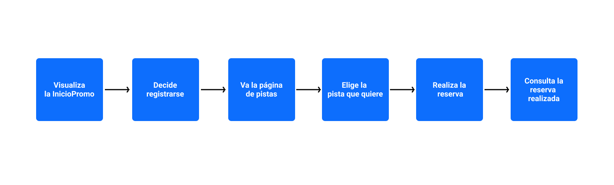

# PaddleGo

PaddleGo es la forma más rápida y sencilla de alquilar tu pista de padel para disfrutar con tus amigos, entrenar o competir. PaddleGo es un servicio de reservas destinado a botiques deportivas de padel. 

Si tu centro deportivo tiene pistas de padel, PaddelGo es lo que estas buscando.

# Functional description

Características de PaddleGo:

- Registro / Inicio de sesión.
- Actualización, modificación y eliminación de perfil.
- Selección de pista.
- Reserva de pista.
- Historial de reservas.

# Casos de uso 



--- 

# Technical description

1. FrontEnd
    * Components
    * Utility

2. BackEnd
    * Modelos
    * Rutas: Usuario, pista, reservas.
    * Validaciones
    * Json Web Token
    * Dependencias disponibles
    * Scripts disponibles

---

# **Front End PaddleGo**

## Components

La parte de cliente ha sido desarrollada con React. A continuacion se mostraran los componentes desarrollados y su funcion como componente.

1. InicioPromo.jsx:
    ```
    const InicioPromo = () => {}
    ```
    Primera página de contacto con el usuario donde se muestra de forma resumida de que trata la aplicacion. Sirve como portal de acceso para usuarios que quieran registrarse en la aplicación o iniciar sesión.

2. Login.jsx:
    ```
    const submitLoginForm = (e) => {}
    const resetFormLogin = (event) => {}
    ```
    - Formulario que ejecuta un Axios con el metodo http "POST" para iniciar sesión, se solicita por medio de inputs un correo existente y una password correcta.

3. Registro.jsx:
    ```
    const submitForm = (e) => {}
    const resetFormRegistro = (event) => {}
    ```
    - Formulario que ejecuta un Axios con el metodo http "POST" para registrar un usuario en la aplicación de PaddleGo, se solicita por medio de inputs informacion básica como: Nombre, correo electronico, password, telefono de contacto.

4. Footer.jsx:
    ```
    const Footer = () => {}
    ```
    - Componente visual e informativo que muestra al creador de la aplicación de PaddleGo y sus redes sociales de Github y Linkedin.

5. InicioApp.jsx:
    ```
    const InicioApp = () => {}
    ```
    - Página de inicio de la aplicación de PaddleGo que realiza Axios con el metodo http "GET" para recoger toda la información que exista del usuario registrado.

6. Usuarios.jsx:
    ```
    const Usuarios = () => {}
    ```
    - Muestra todos los usuarios registrados en PaddleGO en una tabla. Página dedicada a los administradores de la aplicación. Realiza un Axios con el metodo "GET" para poder mostrar todos los usuarios.

7. FiltroUsuarios.jsx:
    ```
    const BorrarUsuario = ({setPerfilUsuario}) => {}
    const handleDelete = () => {}
    ```
    - Componente hijo de 6.Usuarios.jsx. Con la data extraida del padre realiza un filter entre todos los usuarios y lo destaca.

8. PerfilUsuario.jsx:
    ```
    const PerfilUsuario = () => {}
    ```
    - Recoge todos los datos personales del usuario gracias a recoger por el token el id del usuario por medio de un Axios con el metodo http "GET".

9. PerfilEditar.jsx:
    ```
    const modificarUsuario = () => {}
    const inputsUsuario = (event) => {}
    const modificarUsuario =  (event) => {}
    ```
    - Componente hijo de 7.PerfilUsuario.jsx. Recoge por props la data del usuario y por medio de los inputs de un formulario recoge la informacion que pasara al backend por medio de un Axios con el metodo http "PUT".

10. CerrarSesion.jsx:
    ```
    const CerrarSesion = () => {}
    const handleLogout = () => {}
    ```
    - Componente hijo de 7.PerfilUsuario.jsx. Elimina el token del usuario del localstorage y redirige a la ruta raiz del proyecto.

11. BorrarUsuario.jsx:
    ```
    const BorrarUsuario = ({setPerfilUsuario}) => {}
    const handleDelete = () => {}
    ```
    - Componente hijo de 7.PerfilUsuario.jsx. Utiliza un Axios con el metodo http "DELETE" para borrar al usuario de la base de datos y redirige a la ruta raiz del proyecto.

12. Pistas.jsx:
    ```
    const Pistas = () => {}
    ```
    - Recoge todas las pistas registradas en la aplicación por medio de un Axios con el metodo http "GET" y los muestra por pantalla.

13. PistaCrear.jsx:
    ```
    const PistaCrear = () => {}
    ```
    - Recoge de un formulario el value de cada input y seguidamente con un Axios con el metodo http "POST" crea la pista y la muestra.

14. PistaReserva.jsx:
    ```
    const PistaReserva = (props) => {}
    const getPista = () => {}
    const borrarPista = (event) => {}
    const reservar = (event) => {}
    ```
    - Componente hijo de 12.PerfilUsuario.jsx. Muestra las caracteristicas de la pista a reservar elegida (nombre de pista, tipo de pista, ubicacion, estado y capacidad). A los usuarios da la opcion de reservar la pista gracias a un axios con el metodo http "POST" y a los administradores les da la posibilidad de borrar la pista con un Axios "DELETE".

15. PistaEditar.jsx:
    ```
    const modificarPista = (event) => {}
    ```
    - Permite editar las caracteristicas de las pistas (nombre de pista, tipo de pista, ubicacion, estado y capacidad) gracias a un Axios "PUT" de la pista

16. Reservas.jsx:
    ```
    const Reservas = () =>{}
    ```
    - Muestra todas las reservas realizadas en PaddleGO en una tabla. Página dedicada a los administradores de la aplicación. Realiza un Axios con el metodo "GET" para poder mostrar todas las reservas.

17. FiltroReservas.jsx:
    ```
    const FiltroReservas = ({reservas}) => {}
    const filtrarReservas = (event) => {}
    const resetFilter = () => {}
    ```
    - Componente hijo de 6.Usuarios.jsx. Con la data extraida del padre realiza un filter entre todos los usuarios y lo destaca.

18. ReservasUsuario.jsx:
    ```
    const ReservasUsuario = () => {}
    const handleBorrarReserva = (event) => {}
    ```
    - Muestra todas las reservas realizadas por el usuario logeado gracias a un Axios "GET" y da la opcion a que el usuario borre la reserva gracias a un Axios "Delete" a traves de un boton

19. ReservaConcreta.jsx:
    ```
    const ReservaConcreta = (props) => {}
    ```
    - Componente destinado a mostrar la informacion concreta de una reserva concreta.

## Utility

Recopilación de funciones dirigida a la funcionalidad de la aplicacion.

1. AuthToken.jsx:
    ```
    const setAuthToken = token => {}
    ```
    - Una vez registrado o logeado esta funcion pondra el token en la cabecera para agilizar los Axios.

2. PrivateRouter.jsx:
    ```
    function PrivateRoute({ children, ...rest }) {
    ```
    - Convierte los Router de React Router en privados comprobando si tiene token o no, en caso de que no tenga lo envia a la pagina de login en el caso de PaddleGo

## Wireframes and Routers


---

# **Back End PaddleGo**

## Modelos


- Usuario : Nombre, email, password, telefono
- Pista : Nombre, estado, tipo, ubicación, capacidad, idReserva
- Reserva : idUsuario, idPista, fecha

## Rutas relacionadas con el modelo usuario

```
usuarioRouter.get("/usuarios")
```
- Ruta privada que hace uso del metodo http "get" con la que se consultan todos los usuarios registrados en la base de datos de PaddleGo.

```
usuarioRouter.get("/usuario")
```
- Ruta privada que hace uso del metodo http "get" con el que se pueden consultar los datos del usuario registrado de forma individual

```
usuarioRouter.post("/registros")
```
- Ruta publica qe hace uso del metodo http "post", hace uso de asincrona con Async / Await. Esta ruta esta destinada al registro de nuevos usuarios de PaddleGo

```
usuarioRouter.post("/login")
```
- Ruta publica que hace uso del metodo http "post", hace uso de asincrona con Async / Await. Esta ruta pensada para el login de los usuarios ya registrados en PaddleGo

```
usuarioRouter.put("/usuario")
```
- Ruta privada que hace uso del metodo http "put" con la que se puede realizar cambios en los datos del perfil del usuario ya registrado.

```
usuarioRouter.delete("/usuario")
```
- Ruta privada que hace uso del metodo http "delete" con la que se puede borrar el usuario registrado en la base de datos de PaddleGo.


## Rutas relacionadas con el modelo pista

````
pistaRouter.get("/pistas")
````
- Ruta privada que hace uso del metodo http "get" con el que se puede consultar las pistas, su estado, el tipo de pista que hay entre otros

```
pistaRouter.get("/pista/:id")
```
- Ruta privada que hace uso del metodo http "get", su funcion es consultar una pista de forma individual.

```
pistaRouter.post("/pista")
```
- Ruta privada que hace uso del metodo http "post", esta destinada a la creacion de pistas de padel.

```
pistaRouter.put("/pista/:id")
```
- Ruta privada que hace uso del metodo http "put" para la modificacion de las caracteristicas de una pista.

```
pistaRouter.delete("/pista/:id")
```
- Ruta privada que hace uso del metodo http "delete" con la finalidad de borrar una pista creada.


## Rutas relacionadas con el modelo reserva

```
reservaRouter.get("/reservas")
```
- Ruta publica que hace uso del metodo http "get", esta destinada a la consulta de reservas realizadas por los usuarios de PaddleGo.

```
reservaRouter.post("/reserva")
```
- Ruta privada que hace uso del metodo http "post" para la creacion de una reserva mediante el id del usuario recogido por el token y el id de la pista.

```
reservaRouter.get("/reserva/:id")
```
- Ruta privada que hace uso del metodo http "get" para una mostrar reserva concreta que hubiera realizado el usuario registrado.

```
reservaRouter.get("/reservas/usuario/:id")
```
- Ruta privada que hace uso del metodo http "get" que muestra todas las reservas realizadas por el usuario, como si se tratase de un historial de reservas.

```
reservaRouter.get("/reservas/pista/:id")
```
- Ruta privada que hace uso del metodo http "get" con el conocemos cuantas veces se ha reservado la pista y por quien.

```
reservaRouter.delete("/reserva/:id", comprobarToken, (req,res)=>{})
```
- Ruta privada que hace uso del metodo http "get" con el que podemos borrar una reserva realizada.

## Validaciones

- validationId(id){}: Valida la string de Mongo según el número de caracteres que tenga.

- validationPassword(password){}: Valida una password según el tipo de dato que sea, los espacios que posea y el numero de caracteres que tenga.

- validationEmail(email){}: Valida el email por medio de un Regexp

- validationTelefono(telefono){}: Valida la el telefono según el número de caracteres que tenga.

- validationArray(array){}: Valida si es un array por medio del tipo de objeto


## Json Web Token (Jwt)

- crearToken(usuarioToken){}: Creacion del Token

- comprobarToken(req, res, next){}: Comprobación del token

----

## Dependencias disponibles

### Dependencias Backend

- Node v15.10.0

- express v4.17.1

- nodemon v2.0.7

- dotenv v8.2.0

- mongoose v5.11.18

- morgan v1.10.0

- moment v2.29.1

- validator v13.5.2

- bcrypt v5.0.1

- jsonwebtoken v8.5.1

- concurrently 6.0.0

- cors 2.8.5

### Dependencias Frontend 

- axios 0.21.1

- moment 2.29.1

- react 17.0.2

- react-dom 17.0.2

- react-router-dom 5.2.0

- react-scripts 4.0.3

- react-select 4.3.0

- web-vitals 1.1.1


## Scripts disponibles

- Npm run dev: Inicializa el backend y el frontend de forma simultanea

- Npm run inspect: Inicializa la ejecucion del inpsector.


# Tecnologías

Html, Bootstrap 5, Javascript, Node.js, Npm, Express, Mongoose, React, Axios, Postman


# Versiones

- v.1.0 PaddleGo (18/03/2021)

# TODO

- Eleccion de fecha y hora.

- Reserva la hora a la que quieres jugar entre las disponibles. 

- uuid Reservas

- Registro mediante redes sociales (passport npm)

- Añadir metodo de pago

- Roles y permisos.

- Sugerir a tu centro deportivo como sistema de reservas.

- Resguardo de reserva enviada al correo

- Confirmacion de creacion de cuenta mediante correo

- Mencion a tus amigos a para el partido.

- Merchandising.
