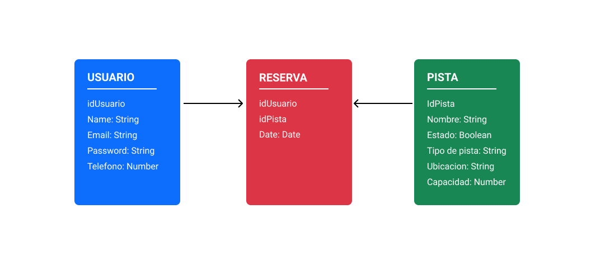

# PaddleGo

PaddleGo es la forma más rápida y sencilla de alquilar tu pista de padel para disfrutar con tus amigos, entrenar o competir. PaddleGo es un servicio de reservas destinado a botiques deportivas de padel. 

Si tu centro deportivo tiene pistas de padel, PaddelGo es lo que estas buscando.

# Functional description

Características de PaddleGo:

- Acceso a todas las páginas de la web.
- Registro / Inicio de sesión.
- Actualización, modificación y eliminación de perfil.
- Selección de pista.
- Reserva de pista.
- Historial de reservas.

# Casos de uso 


--- 

# Technical description

1. Modelos
2. Rutas: Usuario, pista, reservas.
3. Validaciones
4. Json Web Token
5. Dependencias disponibles
6. Scripts disponibles

---

## 1. Modelos



- Usuario : Nombre, email, password, telefono
- Pista : Nombre, estado, tipo, ubicación, capacidad, idReserva
- Reserva : idUsuario, idPista, fecha

----

## 2.1. Rutas relacionadas con el modelo usuario

```
usuarioRouter.get("/usuarios")
```
- Ruta privada que hace uso del metodo http "get" con la que se consultan todos los usuarios registrados en la base de datos de PaddleGo.

```
usuarioRouter.get("/usuario")
```
- Ruta privada que hace uso del metodo http "get" con el que se pueden consultar los datos del usuario registrado de forma individual

```
usuarioRouter.post("/registros")
```
- Ruta publica qe hace uso del metodo http "post", hace uso de asincrona con Async / Await. Esta ruta esta destinada al registro de nuevos usuarios de PaddleGo

```
usuarioRouter.post("/login")
```
- Ruta publica que hace uso del metodo http "post", hace uso de asincrona con Async / Await. Esta ruta pensada para el login de los usuarios ya registrados en PaddleGo

```
usuarioRouter.put("/usuario")
```
- Ruta privada que hace uso del metodo http "put" con la que se puede realizar cambios en los datos del perfil del usuario ya registrado.

```
usuarioRouter.delete("/usuario")
```
- Ruta privada que hace uso del metodo http "delete" con la que se puede borrar el usuario registrado en la base de datos de PaddleGo.

----

## 2.2. Rutas relacionadas con el modelo pista

````
pistaRouter.get("/pistas")
````
- Ruta privada que hace uso del metodo http "get" con el que se puede consultar las pistas, su estado, el tipo de pista que hay entre otros

```
pistaRouter.get("/pista/:id")
```
- Ruta privada que hace uso del metodo http "get", su funcion es consultar una pista de forma individual.

```
pistaRouter.post("/pista")
```
- Ruta privada que hace uso del metodo http "post", esta destinada a la creacion de pistas de padel.

```
pistaRouter.put("/pista/:id")
```
- Ruta privada que hace uso del metodo http "put" para la modificacion de las caracteristicas de una pista.

```
pistaRouter.delete("/pista/:id")
```
- Ruta privada que hace uso del metodo http "delete" con la finalidad de borrar una pista creada.

----

## 2.3. Rutas relacionadas con el modelo reserva

```
reservaRouter.get("/reservas")
```
- Ruta publica que hace uso del metodo http "get", esta destinada a la consulta de reservas realizadas por los usuarios de PaddleGo.

```
reservaRouter.post("/reserva")
```
- Ruta privada que hace uso del metodo http "post" para la creacion de una reserva mediante el id del usuario recogido por el token y el id de la pista.

```
reservaRouter.get("/reserva/:id")
```
- Ruta privada que hace uso del metodo http "get" para una mostrar reserva concreta que hubiera realizado el usuario registrado.

```
reservaRouter.get("/reservas/usuario/:id")
```
- Ruta privada que hace uso del metodo http "get" que muestra todas las reservas realizadas por el usuario, como si se tratase de un historial de reservas.

```
reservaRouter.get("/reservas/pista/:id")
```
- Ruta privada que hace uso del metodo http "get" con el conocemos cuantas veces se ha reservado la pista y por quien.

```
reservaRouter.delete("/reserva/:id", comprobarToken, (req,res)=>{})
```
- Ruta privada que hace uso del metodo http "get" con el que podemos borrar una reserva realizada.

---

## 3. Validaciones

- validationId(id){}: Valida la string de Mongo según el número de caracteres que tenga.

- validationPassword(password){}: Valida una password según el tipo de dato que sea, los espacios que posea y el numero de caracteres que tenga.

- validationEmail(email){}: Valida el email por medio de un Regexp

- validationTelefono(telefono){}: Valida la el telefono según el número de caracteres que tenga.

- validationArray(array){}: Valida si es un array por medio del tipo de objeto

---

## 4. Json Web Token (Jwt)

- crearToken(usuarioToken){}: Creacion del Token

- comprobarToken(req, res, next){}: Comprobación del token

----

## 5. Dependencias disponibles

- Node v15.10.0

- express v4.17.1

- nodemon v2.0.7

- dotenv v8.2.0

- mongoose v5.11.18

- morgan v1.10.0

- moment v2.29.1

- validator v13.5.

- bcrypt v5.0.1

- jsonwebtoken v8.5.1

## 6. Scripts disponibles

- Npm run dev: Inicializa el servidor y reinicia automáticamente la aplicación node cuando se detectan cambios de archivos en el directorio.

- Npm run inspect: Inicializa la ejecucion del inpsector.


# Tecnologías

Html, Css, Javascript, Node.js, Npm, Express, Mongoose, Mongo, React.


# Versiones

- v.1.0 PaddleGo (18/03/2021)

# TODO

- Eleccion de fecha y hora.

- Reserva la hora a la que quieres jugar entre las disponibles. 

- Registro mediante redes sociales (passport npm)

- Añadir metodo de pago

- Roles y permisos.

- Sugerir a tu centro deportivo como sistema de reservas.

- Resguardo de reserva enviada al correo

- Confirmacion de creacion de cuenta mediante correo

- Mencion a tus amigos a para el partido.

- Merchandising.
